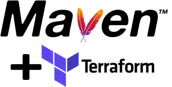

[tf-maven-plugin]:https://search.maven.org/artifact/com.deliveredtechnologies/tf-maven-plugin/0.2.6/maven-plugin
[tf-cmd-api]:https://search.maven.org/artifact/com.deliveredtechnologies/tf-cmd-api/0.2.6/jar
[tf-maven-starter]:https://search.maven.org/artifact/com.deliveredtechnologies/tf-maven-starter/0.2.6/pom
[maven-badge]:https://img.shields.io/badge/maven%20central-0.2.6-green.svg



---


[](https://travis-ci.org/deliveredtechnologies/terraform-maven)
[](https://coveralls.io/github/deliveredtechnologies/terraform-maven?branch=develop)
[![Maven Central][maven-badge]][tf-maven-plugin]

# Terraform Maven Plugin

The Terraform Maven Plugin brings Terraform into Maven and greatly enhances the Terraform code management
lifecycle and management experience. Maven in some form has been the standard for Java project management for over a decade.
Now, all of that Maven goodness can be used with Terraform.

### Contents

* [Artifacts in This Repository](#artifacts-in-this-repository)
* [Benefits of the Terraform Maven Plugin](#benefits-of-the-terraform-maven-plugin)
* [Maven Goals](#maven-goals)
  * [tf:get](#tfget)
  * [tf:init](#tfinit)
  * [tf:plan](#tfplan)
  * [tf:apply](#tfapply)
  * [tf:destroy](#tfdestroy)
  * [tf:package](#tfpackage)
  * [tf:deploy](#tfdeploy)
  * [tf:clean](#tfclean)
* [Setting Up a Terraform Maven Project](#setting-up-a-terraform-maven-project)
* [How to Use Terraform Maven Projects](#how-to-use-terraform-maven-projects)

### Artifacts in This Repository

| Artifact Name    | Version                                           | Description                 |
|------------------|---------------------------------------------------|-----------------------------|
| tf-maven-plugin  | [![Maven Central][maven-badge]][tf-maven-plugin]  | Terraform Maven Plugin      |
| tf-cmd-api       | [![Maven Central][maven-badge]][tf-cmd-api]       | Terraform Command API       |
| tf-maven-starter | [![Maven Central][maven-badge]][tf-maven-starter] | Terraform Maven starter POM |

### Benefits of the Terraform Maven Plugin
* Dependency Management
  * Terraform really has no dependency management to speak of. Even when you use Terraform Enterprise or some other private
    Terraform module registry, a version update to a module means editing the Terraform code in each and every place
    that module is sourced. The Terraform Maven Plugin allows you to specify your dependencies for Terraform the same way
    you specify your dependencies with Java: in an external [Maven POM file](https://maven.apache.org/pom.html). And
    because it's Maven, Terraform modules sourced from Maven repos can also take advantage of version ranges and 
    Maven's SNAPSHOT functionality. No more modifying code for version updates! No more sourcing obscure URLs!
    Hooray, Maven! 
* Packaging as Part of the Build Lifecycle
  * The [package goal](#tfpackage) can package a Terraform root module for deployment into a Maven repo
    or it can package that same Terraform root module with its dependencies for deployment into an isolated environment
    or Terraform Enterprise. It's all part of a single Maven goal/command.
* Deploying Terraform Artifacts to a Maven Repo with an Attached POM is a Snap
  * By default the [deploy goal](#tfdeploy) deploys a zip artifact packaged by the [package goal](#tfpackage) to a Maven repo
    along with the POM of the current Maven Terraform project. But if you want to point to a differnt POM or a different
    artifact for deployment, it can do that too. Easy peasy.
* Simple Integration with CI Tools
  * Get rid of hundreds of lines of untested code in your CI tool and replace it with tested build lifecycle management
    using Maven! Most CI tools either have Maven included or have a Maven plugin available. Less Terraform build logic 
    in your CI tool means more reliable builds and less CI code to maintain. 
* Build Terraform Maven Projects or Standalone Terraform Configurations and Anything In Between
  * You can use the Terraform Maven plugin for building any Terraform, not just Terraform Maven projects!
    The default configuration is opinionated around the Maven project structure. But that's available to override.
    Do you have a different folder containing Terraform modules that you want packaged into a Fat Zip? No problem.
    What about just running a Terraform configuration in some directory that you specify? That works too. You don't lose
    anything with the Terraform Maven plugin. You just gain a whole lot of packaged functionality and the build lifecycle
    power of Maven with Terraform!
    
### Maven Goals

#### tf:get

Description:

Downloads Maven artifacts into a common modules directory and extracts each artifacts
contents into a folder named for the artifact (version agnostic). 

Optional Parameters:

| Name         | Type   | Description                                                                                        |
| ------------ | ------ | -------------------------------------------------------------------------------------------------- |
| tfModulesDir | String | The directory location where Terraform modules will be expanded; defaults to `src/main/.tfmodules` |

---

#### tf:init

Description:

Executes the `terraform init` command. See [https://www.terraform.io/docs/commands/init.html](https://www.terraform.io/docs/commands/init.html).

_Note: tf:init depends on tf:get; so tf:get is always executed when tf:init is specified._

Optional Parameters:

| Name          | Type    | Description                                                                                                         |
| ------------- | ------- | ------------------------------------------------------------------------------------------------------------------- |
| tfRootDir     | String  | The root module directory location where terraform will be initialized; defaults to `src/main/tf/{first dir found}` |
| pluginDir     | String  | Skips plugin installation and loads plugins only from the specified directory                                       |
| getPlugins    | Boolean | Skips plugin installation                                                                                           |
| verifyPlugins | Boolean | Skips release signature validation when installing downloaded plugins (not recommended)                             |

---
 
#### tf:plan

Description:

Executes the `terraform plan` command. See [https://www.terraform.io/docs/commands/plan.html](https://www.terraform.io/docs/commands/plan.html).

Optional Parameters:

| Name           | Type    | Description                                                                                                |
| -------------- | ------- | ---------------------------------------------------------------------------------------------------------- |
| varFiles       | String  | A comma delimited string of tfvars files (e.g. -var-file=foo)                                              |
| tfVars         | String  | A comma delimited string of tfvars (e.g. -var 'name=value')                                                |
| lockTimeout    | Number  | Duration to retry a state lock                                                                             |
| target         | Number  | A resource address to target                                                                               |
| planInput      | Boolean | If set to "true", input variables not directly set will be requested; otherwise, the plan will fail        |
| noColor        | Any     | If this property exists, the -no-color flag is set                                                         |
| destroyPlan    | Any     | If this property exists, a destroy plan is outputted                                                       | 
| planOutputFile | String  | The path to save the generated execution plan                                                              |
| tfRootDir      | String  | A terraform config directory to apply; defaults to `src/main/tf/{first dir found}`, then current directory |
| timeout        | Number  | The maximum time in milliseconds that the terraform apply command can run; defaults to 10min               |
| refreshState   | Boolean | If set to "true" then Terraform will refresh the state before generating the plan                          |
| tfState        | String  | The path to the state file; defaults to `terraform.tfstate`                                                |
 
---

#### tf:apply

Description:

Executes the `terraform apply` command. See [https://www.terraform.io/docs/commands/apply.html](https://www.terraform.io/docs/commands/apply.html).

Optional Parameters:

| Name        | Type   | Description                                                                                                |
| ----------- | ------ | ---------------------------------------------------------------------------------------------------------- |
| varFiles    | String | A comma delimited string of tfvars files (e.g. -var-file=foo)                                              |
| tfVars      | String | A comma delimited string of tfvars (e.g. -var 'name=value')                                                |
| lockTimeout | Number | Duration to retry a state lock                                                                             |
| target      | Number | A resource address to target                                                                               |
| noColor     | Any    | If this property exists, the -no-color flag is set                                                         |
| plan        | String | A terraform plan to apply; if both plan and tfRootDir are specified, only plan is used                     |
| tfRootDir   | String | A terraform config directory to apply; defaults to `src/main/tf/{first dir found}`, then current directory |
| timeout     | Number | The maximum time in milliseconds that the terraform apply command can run; defaults to 10min               |

---

#### tf:destroy

Description:

Executes the `terraform destroy` command. See [https://www.terraform.io/docs/commands/destroy.html](https://www.terraform.io/docs/commands/destroy.html).

Optional Parameters:

| Name        | Type   | Description                                                                                    |
| ----------- | ------ | ---------------------------------------------------------------------------------------------- |
| lockTimeout | Number | Duration to retry a state lock                                                                 |
| target      | Number | A resource address to target                                                                   |
| noColor     | Any    | If this property exists, the -no-color flag is set                                             |
| tfRootDir   | String | A terraform config directory to destroy; defaults to current directory                         |
| timeout     | Number | The maximum time in milliseconds that the terraform destroy command can run; defaults to 10min |

---

#### tf:package

Description:

Recursively packages the Terraform files from the root module directory as target/{artifact-id}-{version}.zip.
Optionally, a fat compressed package can be created instead, which also includes the Terraform module dependencies if available; see the [tf:get goal](#tfget) above.

_Note: Within the fat compressed package, module source paths are updated accordingly so that the pacakge is a wholly contained working module that can be consumed as a module,
extracted, initialized and applied as-is or submitted to Terraform Enterprise._

| Name         | Type    | Description                                                                                          |
| ------------ | ------- | -----------------------------------------------------------------------------------------------------|
| tfRootDir    | String  | The terraform root module directory location; defaults to src/main/tf/{first directory found}        |
| tfModulesDir | String  | The directory that contains the Terraform module depenencies; defaults to src/main/.tfmodules        |
| fatTar       | Boolean | Set to true if a fat compressed tar.gz package should be created, otherwise false; defaults to false |

---

#### tf:deploy

Description:

Deploys a packaged Terraform zip artifact ([see tf:package](#tfpackage)) with a POM to the specified Maven repo.

| Name        | Type   | Description                                                                                                       |
| ----------- | ------ | ----------------------------------------------------------------------------------------------------------------- |
| file        | String | The name of the Terraform zip file to deploy; defaults to target/{artifactId}-{version}.zip                       |
| url         | String | The url of the Maven repo to which the zip file artifact will be deployed                                         |
| pomFile     | String | The path to the pom.xml file to attach to the artifact; defaults to .flattened-pom.xml in the root of the project |
| generatePom | String | If set to "true" then a POM will be generated and attached to the deployment                                      |
| groupId     | String | The groupId for the generated POM (only used if generatePom=true                                                  |
| artifactId  | String | The artifactId for the generated POM (only used if generatePom=true                                               |
| version     | String | The version for the generated POM (only used if generatePom=true                                                  |

---

#### tf:clean

Description:

Deletes all 'terraform' files from terraform configurations along with the Terraform modules directory.

| Name         | Type   | Description                                                                                    |
| ------------ | ------ | ---------------------------------------------------------------------------------------------- |
| tfRootDir    | String  | The terraform root module directory location; defaults to src/main/tf/{first directory found} |
| tfModulesDir | String  | The directory that contains the Terraform module depenencies; defaults to src/main/.tfmodules |

### Setting Up a Terraform Maven Project

1. Create a generic Maven project. [see Maven Getting Started Guide](https://maven.apache.org/guides/getting-started/index.html)
2. Add a _src/main/tf_ directory, under which one or more Terraform root module will reside.
3. Add the Terraform Maven Starter POM as the parent project by adding the following to the POM under the _project_ tag.

```xml
  <parent>
    <groupId>com.deliveredtechnologies</groupId>
    <artifactId>tf-maven-starter</artifactId>
    <version>0.2.1</version>
  </parent>
```

4. Add the Terraform Maven starter POM as a dependency as follows.

```xml
  <dependencies>
    <dependency>
      <groupId>com.deliveredtechnologies</groupId>
      <artifactId>tf-maven-starter</artifactId>
      <version>0.2.1</version>
      <type>pom</type>
    </dependency>
  </dependencies>
```

5. Configure the build plugins with the Terraform Maven Starter POM.

```xml
  <build>
    <plugins>
      <plugin>
        <groupId>org.apache.maven.plugins</groupId>
        <artifactId>maven-install-plugin</artifactId>
        <executions>
          <execution>
            <id>default-install</id>
            <phase>never</phase>
          </execution>
        </executions>
      </plugin>
      <plugin>
        <groupId>org.apache.maven.plugins</groupId>
        <artifactId>maven-deploy-plugin</artifactId>
        <configuration>
          <skip>true</skip>
        </configuration>
      </plugin>
      <plugin>
        <groupId>com.deliveredtechnologies</groupId>
        <artifactId>tf-maven-plugin</artifactId>
      </plugin>
      <plugin>
        <groupId>org.codehaus.mojo</groupId>
        <artifactId>flatten-maven-plugin</artifactId>
      </plugin>
    </plugins>
  </build>
```

### How to Use Terraform Maven Projects

If you used the Starter POM, the following Terraform Maven goals are mapped to the project's Maven phases.

| Maven Phase | Terraform Maven Goals |
|-------------|-----------------------|
| install     | deploy                |
| validate    | init, plan            |
| clean       | clean                 |
| package     | package               |
| deploy      | deploy                |
